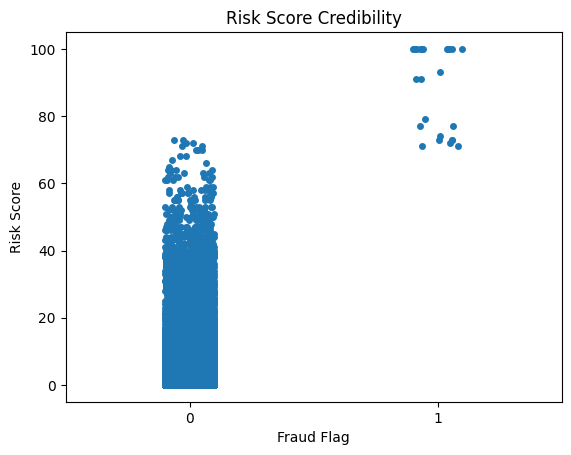
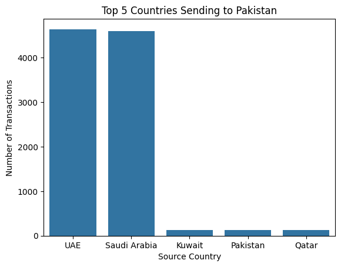
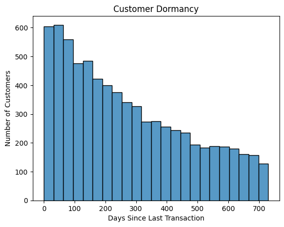
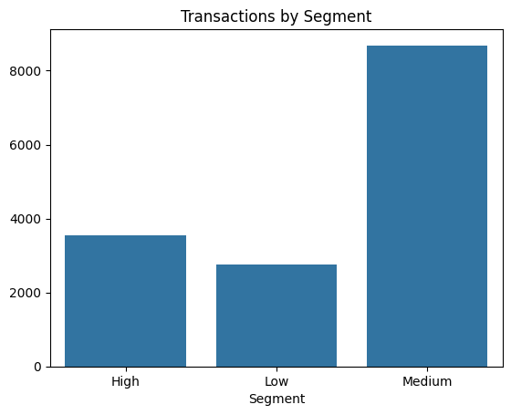

# Meezan Bank International Transactions — Exploratory Data Analysis

Exploratory data analysis on a **Synthetic** international banking transaction dataset, covering fraud risk scoring, remittance corridor patterns, and customer activity behavior. Built as a portfolio project applying pandas, seaborn, and matplotlib to a realistic financial dataset.

> **Note on data**: This dataset is **synthetically generated** for analysis practice. It does not contain real customer or bank data.

---

## About the Project

This project explores an international transactions dataset modeled after Islamic banking operations, aiming to answer real, business-relevant questions rather than just describing the data. The analysis covers data quality and cleaning, fraud risk score credibility, remittance corridor concentration, customer dormancy, and customer segmentation by activity level.

**Dataset**: [Meezan Bank International Transactions Dataset](https://www.kaggle.com/datasets/abdullahmeo/meezan-bank-international-transactions-dataset) (Kaggle)
**Size**: 15,000 transactions, 25 columns
**Tools used**: Python, pandas, seaborn, matplotlib

---

## Data Cleaning Summary

- Identified and dropped `Sharia_Compliant`, a constant column (every row was "Yes"), since it carried no analytical value.
- Merged `Transaction_Date` and `Transaction_Time` into a single `Transaction_DateTime` column for proper time-based analysis.
- Handled 3,752 missing entries in `Contract_Type` by labeling them "Not Specified" rather than dropping the rows.
- Confirmed no duplicate `Transaction_ID` entries.

---

## Key Findings

- **Risk Score is credible but imperfect.** Fraud-flagged transactions show a sharply higher average Risk Score than non-fraud ones, confirming the score carries real signal. However, several non-flagged transactions still carry risk scores above 50, and Risk Score correlates very strongly with transaction amount — suggesting it may partly just be re-measuring transaction size rather than capturing independent risk.

- **Fraud and AML flags are too rare to analyze reliably.** Only 25 of 15,000 transactions are fraud-flagged, and AML flags are even rarer — too little signal to build statistically meaningful group comparisons, so the analysis pivoted toward broader, better-supported questions.

- **Remittance flow into Pakistan is heavily concentrated.** UAE and Saudi Arabia dominate as source countries for transactions into Pakistan, plausibly reflecting large Pakistani expatriate communities working in construction, engineering, healthcare, retail, and domestic service sectors in the Gulf.

- **A large share of customers have gone dormant.** Looking at days since each customer's last transaction, only a small portion of customers were recently active, while a large share have gone quiet for an extended period — pointing to a real customer retention and re-engagement opportunity.

- **Customer value is concentrated in a mid-tier segment.** Segmenting customers by transaction count (Low: 1, Medium: 2-3, High: 4+) shows the bulk of transaction activity comes from the Medium and High activity groups, not one-time users.

---

## Charts

### Risk Score Credibility


### Top 5 Countries Sending to Pakistan


### Customer Dormancy


### Transactions by Segment


---

## Project Structure

```
meezan-transactions-eda/
├── README.md
├── meezan-bank-analysis (1).ipynb
└── images/
    ├── risk_score_credibility.png
    ├── top_countries_pakistan.png
    ├── customer_dormancy.png
    └── transactions_by_segment.png
```

---

## Notebook

The full analysis, including all data cleaning steps and code, is available in [`meezan-bank-analysis (1).ipynb`](meezan-bank-analysis%20(1).ipynb).

---

## Author

**Mahad** — Computer Science student, Bahria University Islamabad
Built as part of an ongoing AI/ML skills roadmap, applying pandas/EDA fundamentals to a realistic dataset.
